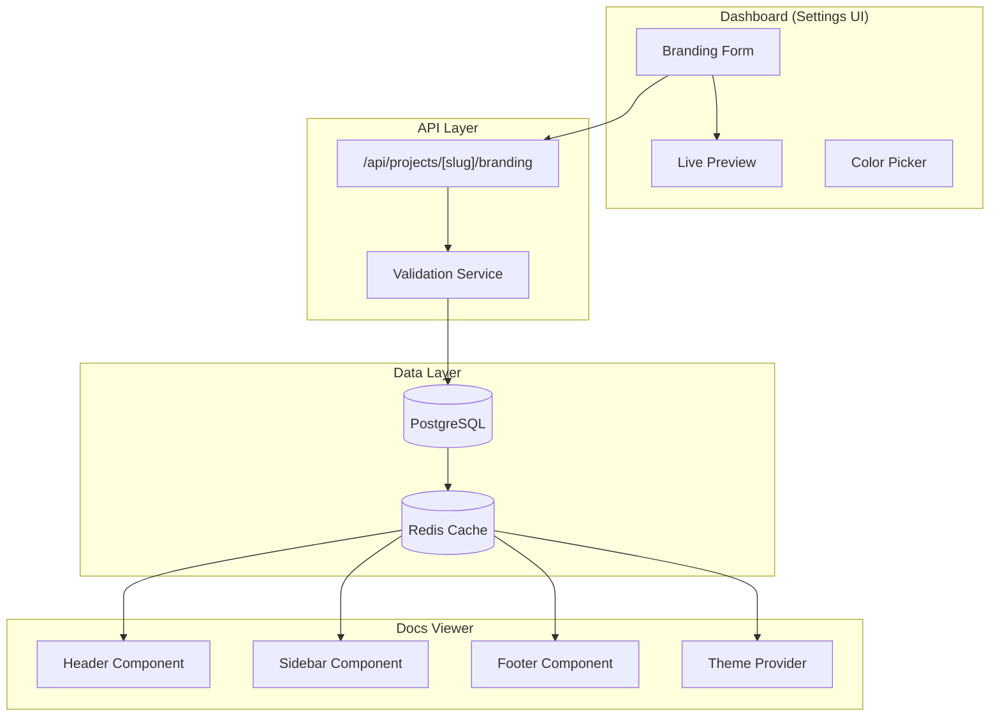

# Design Document: Docs Branding & Customization

## Overview

This design document outlines the technical implementation of the Docs Branding & Customization feature for RepoDocs. The feature enables customers to customize their documentation site appearance with branding elements including logo, favicon, colors, footer content, social links, and advanced options like custom CSS and analytics integration.

The implementation follows a layered architecture:
1. **Data Layer**: Prisma schema extension with JSON branding field
2. **Cache Layer**: Redis/memory caching for branding data
3. **API Layer**: REST endpoints for CRUD operations on branding settings
4. **UI Layer**: Settings dashboard with live preview and docs viewer components

## Architecture



## Components and Interfaces

### 1. Branding Settings Type Definition

```typescript
// src/types/branding.ts

export interface FooterLink {
  label: string;
  url: string;
}

export interface SocialLinks {
  github?: string;
  twitter?: string;
  discord?: string;
}

export interface BrandingSettings {
  // Phase 1 - Core Branding
  logoUrl?: string;
  faviconUrl?: string;
  siteTitle?: string;
  primaryColor?: string;
  
  // Phase 2 - Extended Customization
  footerText?: string;
  footerLinks?: FooterLink[];
  socialLinks?: SocialLinks;
  hidePoweredBy?: boolean;
  
  // Phase 3 - Advanced
  customCss?: string;
  googleAnalyticsId?: string;
  defaultTheme?: 'light' | 'dark' | 'system';
}

export interface BrandingValidationError {
  field: string;
  message: string;
}

export type BrandingUpdatePayload = Partial<BrandingSettings>;
```

### 2. Prisma Schema Extension

```prisma
// Addition to prisma/schema.prisma

model Project {
  // ... existing fields ...
  
  // Branding settings stored as JSON
  branding Json? @default("{}")
}
```

### 3. Validation Service

```typescript
// src/lib/branding/validation.ts

export interface ValidationResult {
  valid: boolean;
  errors: BrandingValidationError[];
}

export function validateBrandingSettings(settings: BrandingUpdatePayload): ValidationResult;
export function validateUrl(url: string): boolean;
export function validateHexColor(color: string): boolean;
export function validateGoogleAnalyticsId(id: string): boolean;
export function sanitizeCustomCss(css: string): string;
```

### 4. Branding API Endpoint

```typescript
// src/app/api/projects/[slug]/branding/route.ts

// GET - Retrieve branding settings
// PUT - Update branding settings (full replace)
// PATCH - Partial update branding settings
```

### 5. Cache Integration

```typescript
// src/lib/cache/branding.ts

export function getBrandingCacheKey(projectSlug: string): string;
export async function getCachedBranding(projectSlug: string): Promise<BrandingSettings | null>;
export async function cacheBranding(projectSlug: string, branding: BrandingSettings): Promise<void>;
export async function invalidateBrandingCache(projectSlug: string): Promise<void>;
```

### 6. UI Components

#### Settings Form Component
```typescript
// src/components/dashboard/BrandingForm.tsx

interface BrandingFormProps {
  projectSlug: string;
  initialSettings: BrandingSettings;
  userPlan: 'HOBBY' | 'PRO' | 'TEAM';
}
```

#### Live Preview Component
```typescript
// src/components/dashboard/BrandingPreview.tsx

interface BrandingPreviewProps {
  settings: BrandingSettings;
  projectName: string;
}
```

#### Docs Viewer Integration
```typescript
// src/components/docs/BrandedHeader.tsx
// src/components/docs/BrandedFooter.tsx
// src/components/docs/BrandedSidebar.tsx
```

## Data Models

### BrandingSettings JSON Schema

```json
{
  "$schema": "http://json-schema.org/draft-07/schema#",
  "type": "object",
  "properties": {
    "logoUrl": {
      "type": "string",
      "format": "uri",
      "maxLength": 500
    },
    "faviconUrl": {
      "type": "string",
      "format": "uri",
      "maxLength": 500
    },
    "siteTitle": {
      "type": "string",
      "maxLength": 100
    },
    "primaryColor": {
      "type": "string",
      "pattern": "^#([A-Fa-f0-9]{6}|[A-Fa-f0-9]{3})$"
    },
    "footerText": {
      "type": "string",
      "maxLength": 500
    },
    "footerLinks": {
      "type": "array",
      "maxItems": 5,
      "items": {
        "type": "object",
        "properties": {
          "label": { "type": "string", "maxLength": 50 },
          "url": { "type": "string", "format": "uri" }
        },
        "required": ["label", "url"]
      }
    },
    "socialLinks": {
      "type": "object",
      "properties": {
        "github": { "type": "string", "format": "uri" },
        "twitter": { "type": "string", "format": "uri" },
        "discord": { "type": "string", "format": "uri" }
      }
    },
    "hidePoweredBy": {
      "type": "boolean"
    },
    "customCss": {
      "type": "string",
      "maxLength": 10000
    },
    "googleAnalyticsId": {
      "type": "string",
      "pattern": "^(G-[A-Z0-9]+|UA-[0-9]+-[0-9]+)$"
    },
    "defaultTheme": {
      "type": "string",
      "enum": ["light", "dark", "system"]
    }
  }
}
```

### Database Migration

```sql
-- Migration: Add branding column to Project table
ALTER TABLE "Project" ADD COLUMN "branding" JSONB DEFAULT '{}';
```

### Cache Key Structure

```
branding:{projectSlug} -> JSON string of BrandingSettings
```

## Correctness Properties

*A property is a characteristic or behavior that should hold true across all valid executions of a system—essentially, a formal statement about what the system should do. Properties serve as the bridge between human-readable specifications and machine-verifiable correctness guarantees.*

### Property 1: URL Validation

*For any* string input, the URL validator SHALL correctly identify valid URLs (matching standard URL patterns with http/https schemes) and reject invalid URLs (malformed strings, missing schemes, invalid characters).

**Validates: Requirements 1.4, 2.4, 6.4, 7.4, 15.1**

### Property 2: Hex Color Validation

*For any* string input, the hex color validator SHALL accept strings matching the pattern `#RRGGBB` or `#RGB` (case-insensitive) and reject all other strings.

**Validates: Requirements 4.4, 15.2**

### Property 3: Google Analytics ID Validation

*For any* string input, the Google Analytics ID validator SHALL accept strings matching `G-[A-Z0-9]+` (GA4) or `UA-[0-9]+-[0-9]+` (Universal Analytics) patterns and reject all other strings.

**Validates: Requirements 10.3, 10.4**

### Property 4: Text Length Validation

*For any* text field with a maximum length constraint and any string input, strings with length less than or equal to the maximum SHALL be accepted, and strings exceeding the maximum SHALL be rejected with an appropriate error message.

**Validates: Requirements 3.4, 5.4, 9.3, 15.3**

### Property 5: Branding Settings Round-Trip

*For any* valid BrandingSettings object, saving it to the database and then retrieving it SHALL produce an equivalent object (all fields preserved with identical values).

**Validates: Requirements 1.1, 2.1, 3.1, 4.1, 5.1, 6.1, 7.1, 8.1, 9.1, 10.1, 11.1, 12.1**

### Property 6: Plan-Based Feature Access

*For any* user with a given plan (HOBBY, PRO, TEAM) and any plan-restricted feature (hidePoweredBy, customCss), the system SHALL allow the feature only if the user's plan is in the allowed plans list for that feature.

**Validates: Requirements 8.1, 8.4, 9.1, 9.4**

### Property 7: Branding Rendering Completeness

*For any* BrandingSettings object with configured values, the rendered documentation output SHALL contain all configured values in their appropriate locations (logo in header, favicon in head, primary color in CSS variables, footer text in footer, etc.).

**Validates: Requirements 1.2, 2.2, 3.2, 4.2, 5.2, 6.2, 7.2, 8.2, 8.3, 9.2, 10.2, 11.2**

### Property 8: Cache Invalidation on Update

*For any* project with cached branding settings, updating the branding settings SHALL invalidate the cache such that subsequent reads return the updated values.

**Validates: Requirements 12.2, 13.2**

### Property 9: Cache Miss Database Fallback

*For any* project with branding settings in the database but not in cache, requesting branding settings SHALL fetch from the database, return the correct values, and populate the cache.

**Validates: Requirements 13.1, 13.4**

### Property 10: CSS Sanitization

*For any* custom CSS string containing potentially dangerous patterns (javascript:, expression(), url() with data:, @import with external URLs), the sanitizer SHALL remove or neutralize these patterns while preserving safe CSS rules.

**Validates: Requirements 15.4**

### Property 11: Footer Links Array Limit

*For any* array of footer links, the validator SHALL accept arrays with 5 or fewer items and reject arrays with more than 5 items.

**Validates: Requirements 6.3**

### Property 12: Theme Enum Validation

*For any* string input for the defaultTheme field, the validator SHALL accept only "light", "dark", or "system" and reject all other values.

**Validates: Requirements 11.3**

## Error Handling

### Validation Errors

| Error Type | HTTP Status | Response Format |
|------------|-------------|-----------------|
| Invalid URL format | 400 | `{ error: "Invalid URL format", field: "logoUrl" }` |
| Invalid hex color | 400 | `{ error: "Invalid hex color format", field: "primaryColor" }` |
| Text too long | 400 | `{ error: "Text exceeds maximum length of X characters", field: "footerText" }` |
| Invalid GA ID | 400 | `{ error: "Invalid Google Analytics ID format", field: "googleAnalyticsId" }` |
| Plan restriction | 403 | `{ error: "This feature requires PRO or TEAM plan", field: "hidePoweredBy" }` |
| Too many footer links | 400 | `{ error: "Maximum 5 footer links allowed", field: "footerLinks" }` |
| Invalid theme value | 400 | `{ error: "Theme must be 'light', 'dark', or 'system'", field: "defaultTheme" }` |

### Database Errors

- Connection failures: Return 503 with retry-after header
- Constraint violations: Return 400 with specific field error
- Transaction failures: Rollback and return 500

### Cache Errors

- Redis connection failure: Fall back to database read
- Cache write failure: Log error, continue with database (eventual consistency)
- Cache read failure: Fall back to database read

## Testing Strategy

### Unit Tests

Unit tests focus on specific examples and edge cases:

1. **Validation Functions**
   - Test each validator with known valid/invalid inputs
   - Test boundary conditions (empty strings, max length, special characters)
   - Test edge cases (unicode, whitespace, null/undefined)

2. **CSS Sanitization**
   - Test known XSS patterns are removed
   - Test safe CSS is preserved
   - Test edge cases (nested rules, media queries)

3. **Plan Access Control**
   - Test each plan against each restricted feature
   - Test upgrade/downgrade scenarios

### Property-Based Tests

Property-based tests verify universal properties across generated inputs. Each test runs minimum 100 iterations.

**Testing Library**: fast-check (TypeScript property-based testing library)

**Test Configuration**:
```typescript
import fc from 'fast-check';

// Minimum 100 iterations per property
const testConfig = { numRuns: 100 };
```

**Property Test Implementation**:

1. **Property 1: URL Validation** - Generate random strings, verify validator correctly classifies valid vs invalid URLs
2. **Property 2: Hex Color Validation** - Generate random strings, verify validator correctly classifies valid vs invalid hex colors
3. **Property 3: GA ID Validation** - Generate random strings, verify validator correctly classifies valid vs invalid GA IDs
4. **Property 4: Text Length Validation** - Generate strings of various lengths, verify length constraints are enforced
5. **Property 5: Branding Round-Trip** - Generate valid BrandingSettings, save and retrieve, verify equality
6. **Property 6: Plan Access** - Generate user/feature combinations, verify access control
7. **Property 7: Rendering Completeness** - Generate BrandingSettings, render, verify all values present
8. **Property 8: Cache Invalidation** - Generate settings, update, verify cache reflects changes
9. **Property 9: Cache Miss Fallback** - Clear cache, request settings, verify database fallback
10. **Property 10: CSS Sanitization** - Generate CSS with dangerous patterns, verify sanitization
11. **Property 11: Footer Links Limit** - Generate arrays of various sizes, verify limit enforcement
12. **Property 12: Theme Enum** - Generate strings, verify only valid enum values accepted

### Integration Tests

- API endpoint tests with real database
- Cache integration tests with Redis
- End-to-end settings save and docs rendering

