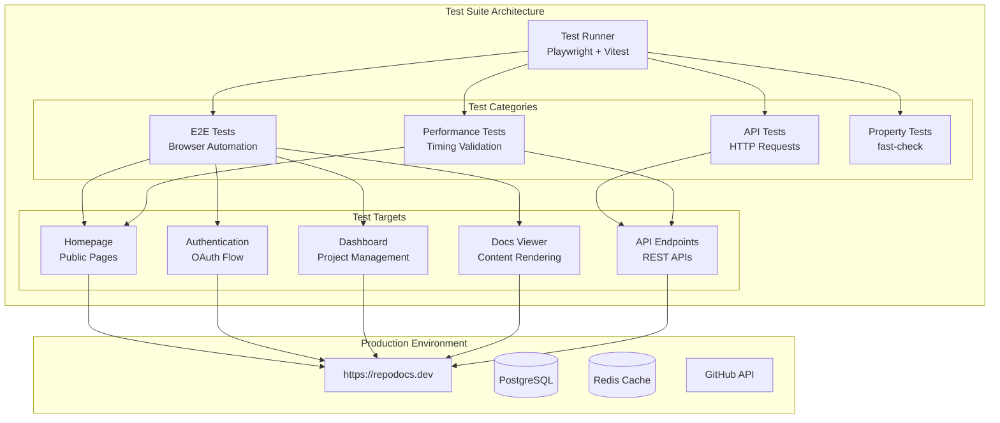

# Design Document: Production Testing for RepoDocs

## Overview

This design document outlines the architecture and implementation approach for a comprehensive production test suite for RepoDocs (https://repodocs.dev). The test suite will validate all critical functionality including public pages, authentication, dashboard, project management, documentation viewer, custom domains, API endpoints, performance, and error handling.

The test suite will be implemented using Playwright for end-to-end browser testing and Node.js for API testing, with fast-check for property-based testing where applicable.

## Architecture



## Components and Interfaces

### Test Configuration

```typescript
// tests/config/test.config.ts
interface TestConfig {
  baseUrl: string;
  timeout: number;
  retries: number;
  workers: number;
  testUser?: {
    email: string;
    sessionToken: string;
  };
}

const config: TestConfig = {
  baseUrl: process.env.TEST_BASE_URL || 'https://repodocs.dev',
  timeout: 30000,
  retries: 2,
  workers: 4,
};
```

### Page Object Models

```typescript
// tests/pages/HomePage.ts
interface HomePage {
  navigate(): Promise<void>;
  getHeroHeading(): Promise<string>;
  getFeatureCards(): Promise<string[]>;
  getPricingPlans(): Promise<PricingPlan[]>;
  clickGetStarted(): Promise<void>;
  clickViewDocs(): Promise<void>;
}

// tests/pages/LoginPage.ts
interface LoginPage {
  navigate(): Promise<void>;
  isGitHubButtonVisible(): Promise<boolean>;
  clickGitHubSignIn(): Promise<void>;
}

// tests/pages/DashboardPage.ts
interface DashboardPage {
  navigate(): Promise<void>;
  getProjects(): Promise<Project[]>;
  isEmptyState(): Promise<boolean>;
  clickNewProject(): Promise<void>;
  clickProjectSettings(slug: string): Promise<void>;
}

// tests/pages/DocsPage.ts
interface DocsPage {
  navigate(project: string, version: string, slug?: string): Promise<void>;
  getSidebarItems(): Promise<NavItem[]>;
  getTableOfContents(): Promise<Heading[]>;
  getContent(): Promise<string>;
  openSearch(): Promise<void>;
  search(query: string): Promise<SearchResult[]>;
}
```

### API Test Utilities

```typescript
// tests/utils/api.ts
interface ApiClient {
  get(path: string, options?: RequestOptions): Promise<ApiResponse>;
  post(path: string, body: unknown, options?: RequestOptions): Promise<ApiResponse>;
  withAuth(token: string): ApiClient;
}

interface ApiResponse {
  status: number;
  body: unknown;
  headers: Headers;
  responseTime: number;
}

interface HealthResponse {
  status: 'healthy' | 'unhealthy' | 'degraded';
  timestamp: string;
  services: {
    database: ServiceStatus;
    redis: ServiceStatus;
    app: ServiceStatus;
  };
  responseTime: number;
}

interface SearchResponse {
  results: SearchResult[];
}

interface SearchResult {
  title: string;
  description?: string;
  slug: string;
  path: string;
  snippet: string;
}
```

### Performance Test Utilities

```typescript
// tests/utils/performance.ts
interface PerformanceMetrics {
  loadTime: number;
  firstContentfulPaint: number;
  largestContentfulPaint: number;
  timeToInteractive: number;
}

interface PerformanceValidator {
  measurePageLoad(url: string): Promise<PerformanceMetrics>;
  measureApiResponse(endpoint: string): Promise<number>;
  assertLoadTime(metrics: PerformanceMetrics, maxMs: number): void;
  assertApiTime(responseTime: number, maxMs: number): void;
}
```

## Data Models

### Test Data Structures

```typescript
// tests/types/index.ts
interface PricingPlan {
  name: string;
  price: string;
  features: string[];
}

interface Project {
  id: string;
  name: string;
  slug: string;
  repoFullName: string;
  branch: string;
}

interface NavItem {
  title: string;
  path: string;
  children?: NavItem[];
}

interface Heading {
  id: string;
  text: string;
  level: number;
}

interface TestResult {
  name: string;
  status: 'passed' | 'failed' | 'skipped';
  duration: number;
  error?: string;
}
```

### Test Fixtures

```typescript
// tests/fixtures/index.ts
interface TestFixtures {
  validProjectData: {
    repoUrl: string;
    name: string;
    slug: string;
    branch: string;
    docsPath: string;
  };
  invalidProjectData: {
    duplicateSlug: typeof validProjectData;
    invalidUrl: typeof validProjectData;
    emptyName: typeof validProjectData;
  };
  searchQueries: {
    valid: string[];
    tooShort: string[];
    noResults: string[];
  };
}
```

## Correctness Properties

*A property is a characteristic or behavior that should hold true across all valid executions of a system—essentially, a formal statement about what the system should do. Properties serve as the bridge between human-readable specifications and machine-verifiable correctness guarantees.*

### Property 1: Page Load Performance

*For any* page type (homepage, dashboard, docs), loading the page should complete within 3 seconds.

**Validates: Requirements 8.1, 8.2, 8.3**

### Property 2: Authentication Guard Redirect

*For any* protected route (dashboard, settings, new project), an unauthenticated request should result in a redirect to /login.

**Validates: Requirements 2.4**

### Property 3: Project Display Completeness

*For any* project displayed in the dashboard list, the rendered output should include the project name, repository full name, branch, and action buttons (View, Settings).

**Validates: Requirements 3.3**

### Property 4: Invalid URL Rejection

*For any* GitHub URL that does not match the pattern `github.com/owner/repo`, submitting the project creation form should display an error message.

**Validates: Requirements 4.4**

### Property 5: Docs Page Structure

*For any* valid project and version combination, the docs page should render with a sidebar, main content area, and table of contents components.

**Validates: Requirements 5.1**

### Property 6: Table of Contents Heading Reflection

*For any* document containing headings, the table of contents should display entries corresponding to each heading in the document.

**Validates: Requirements 5.3**

### Property 7: Sidebar Navigation

*For any* sidebar navigation item, clicking it should navigate to the corresponding document path.

**Validates: Requirements 5.4**

### Property 8: TOC Anchor Scrolling

*For any* table of contents entry, clicking it should scroll the page to the corresponding heading anchor.

**Validates: Requirements 5.5**

### Property 9: Code Block Syntax Highlighting

*For any* code block in a docs page, the rendered HTML should contain syntax highlighting classes applied by Shiki.

**Validates: Requirements 5.6**

### Property 10: Search Results Relevance

*For any* search query of 2+ characters that matches document content, the search results should contain documents with matching titles or content.

**Validates: Requirements 5.8**

### Property 11: Subdomain Routing

*For any* subdomain request to `{project}.repodocs.dev`, the middleware should rewrite the request to `/docs/{project}/main`.

**Validates: Requirements 6.3**

### Property 12: Health Check Response Structure

*For any* call to GET /api/health, the response should contain status, services object (with database, redis, app), and responseTime fields.

**Validates: Requirements 7.1**

### Property 13: Search API Response Structure

*For any* valid search query (2+ characters), the API response should contain a results array where each result has title, path, and snippet fields.

**Validates: Requirements 7.4**

### Property 14: Short Query Empty Results

*For any* search query with fewer than 2 characters, the search API should return an empty results array.

**Validates: Requirements 7.5**

### Property 15: Webhook Signature Validation

*For any* webhook request with an invalid or missing signature, the API should return HTTP 401 status.

**Validates: Requirements 7.8**

### Property 16: API Response Time

*For any* API endpoint call, the response time should be within 500ms.

**Validates: Requirements 8.4**

### Property 17: Search API Response Time

*For any* search API call, the response time should be within 200ms.

**Validates: Requirements 8.5**

### Property 18: 404 Error Handling

*For any* request to a non-existent resource (page or docs), the response should be a 404 status with appropriate error page.

**Validates: Requirements 9.1, 9.2**

### Property 19: API Error Response Format

*For any* API endpoint that encounters an error, the response should contain an error field with a descriptive message.

**Validates: Requirements 9.3**

### Property 20: SEO Metadata Presence

*For any* docs page, the HTML should contain title, meta description, and Open Graph tags.

**Validates: Requirements 10.1**


## Error Handling

### Test Failure Handling

```typescript
// tests/utils/error-handling.ts
interface TestError {
  testName: string;
  error: Error;
  screenshot?: string;
  networkLogs?: NetworkLog[];
  consoleLogs?: ConsoleLog[];
}

class TestErrorHandler {
  async captureFailure(page: Page, testName: string, error: Error): Promise<TestError> {
    const screenshot = await page.screenshot({ path: `screenshots/${testName}.png` });
    const networkLogs = await this.getNetworkLogs(page);
    const consoleLogs = await this.getConsoleLogs(page);
    
    return {
      testName,
      error,
      screenshot: screenshot.toString('base64'),
      networkLogs,
      consoleLogs,
    };
  }
}
```

### Network Error Handling

- **Timeout Errors**: Retry up to 3 times with exponential backoff
- **Connection Errors**: Log and mark test as infrastructure failure
- **HTTP 5xx Errors**: Capture response body and headers for debugging
- **HTTP 4xx Errors**: Validate against expected error responses

### Authentication Errors

- **Session Expired**: Re-authenticate and retry test
- **OAuth Failures**: Skip OAuth-dependent tests with appropriate message
- **Token Refresh**: Handle token refresh during long-running tests

### Graceful Degradation

- Tests should continue running even if some services are degraded
- Health check tests should validate degraded state handling
- Performance tests should account for network variability

## Testing Strategy

### Test Framework Selection

- **Playwright**: End-to-end browser testing with cross-browser support
- **Vitest**: Fast test runner with TypeScript support
- **fast-check**: Property-based testing library for generating test inputs

### Test Organization

```
tests/
├── e2e/
│   ├── homepage.spec.ts
│   ├── auth.spec.ts
│   ├── dashboard.spec.ts
│   ├── docs.spec.ts
│   └── project-management.spec.ts
├── api/
│   ├── health.spec.ts
│   ├── search.spec.ts
│   ├── projects.spec.ts
│   └── webhook.spec.ts
├── performance/
│   ├── page-load.spec.ts
│   └── api-response.spec.ts
├── properties/
│   ├── auth-guard.property.ts
│   ├── search.property.ts
│   ├── routing.property.ts
│   └── api-response.property.ts
├── pages/
│   ├── HomePage.ts
│   ├── LoginPage.ts
│   ├── DashboardPage.ts
│   └── DocsPage.ts
├── fixtures/
│   └── test-data.ts
├── utils/
│   ├── api.ts
│   ├── performance.ts
│   └── error-handling.ts
└── config/
    └── test.config.ts
```

### Dual Testing Approach

**Unit/Example Tests**: Verify specific scenarios and edge cases
- Homepage displays correct content
- Login page has GitHub button
- Specific API responses match expected format

**Property-Based Tests**: Verify universal properties across generated inputs
- All protected routes redirect unauthenticated users
- All search queries return properly structured results
- All API errors have consistent format

### Property-Based Testing Configuration

```typescript
// tests/properties/config.ts
import { fc } from 'fast-check';

export const propertyConfig = {
  numRuns: 100,  // Minimum 100 iterations per property
  verbose: true,
  seed: Date.now(),
};

// Example property test structure
// Feature: production-testing, Property 14: Short Query Empty Results
fc.assert(
  fc.property(
    fc.string({ maxLength: 1 }),
    async (shortQuery) => {
      const response = await api.get(`/api/search?q=${shortQuery}&project=test`);
      return response.body.results.length === 0;
    }
  ),
  propertyConfig
);
```

### Test Execution Strategy

1. **Smoke Tests**: Quick validation of critical paths (< 2 minutes)
2. **Full E2E Suite**: Complete browser-based testing (< 15 minutes)
3. **API Tests**: All API endpoint validation (< 5 minutes)
4. **Performance Tests**: Load time and response time validation (< 5 minutes)
5. **Property Tests**: Property-based testing with 100+ iterations (< 10 minutes)

### CI/CD Integration

```yaml
# .github/workflows/production-tests.yml
name: Production Tests
on:
  schedule:
    - cron: '0 */6 * * *'  # Every 6 hours
  workflow_dispatch:

jobs:
  test:
    runs-on: ubuntu-latest
    steps:
      - uses: actions/checkout@v4
      - uses: actions/setup-node@v4
      - run: npm ci
      - run: npx playwright install
      - run: npm run test:production
      - uses: actions/upload-artifact@v4
        if: failure()
        with:
          name: test-results
          path: test-results/
```

### Test Data Management

- Use dedicated test project in production for safe testing
- Clean up test data after each test run
- Use unique identifiers to prevent test interference
- Mock external services (GitHub OAuth) where necessary

### Reporting

- Generate HTML reports with screenshots on failure
- Track test metrics over time (pass rate, duration)
- Alert on test failures via Slack/email
- Dashboard for test health visualization
